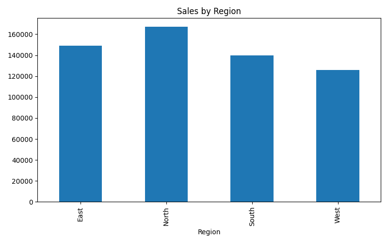
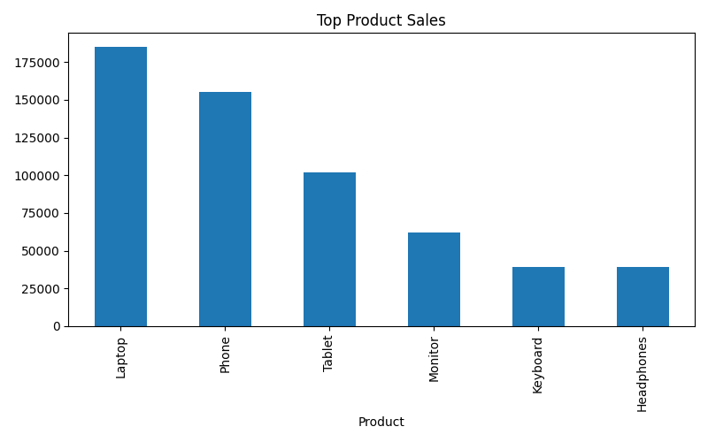

# Sales & Revenue Dashboard

## Project Overview
This project analyzes sales transactions to derive revenue insights and visualize business performance.

## Features
- Sales KPI calculation
- Profit analysis
- Regional sales visualization
- Product performance comparison

## Technologies Used
- Python
- pandas
- matplotlib

## Folder Structure
- data/
- notebooks/
- screenshots/
- reports/

## How to Run
```bash
pip install -r requirements.txt
cd notebooks
python sales_analysis.py
```

## Output Screenshots

### Sales by Region


### Top Products

